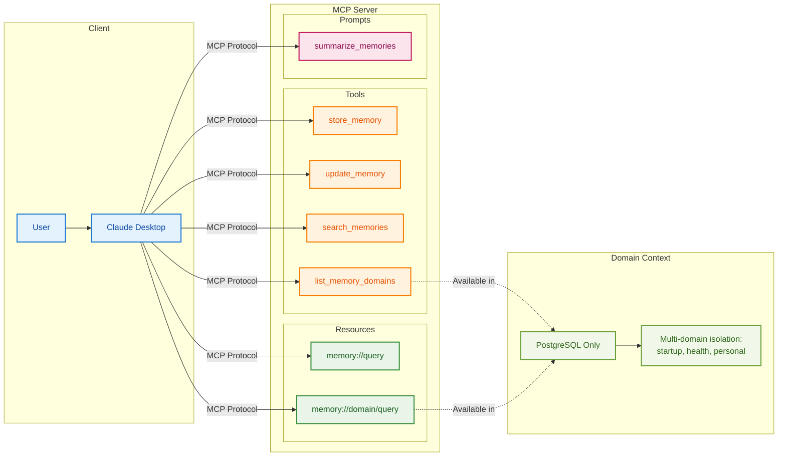
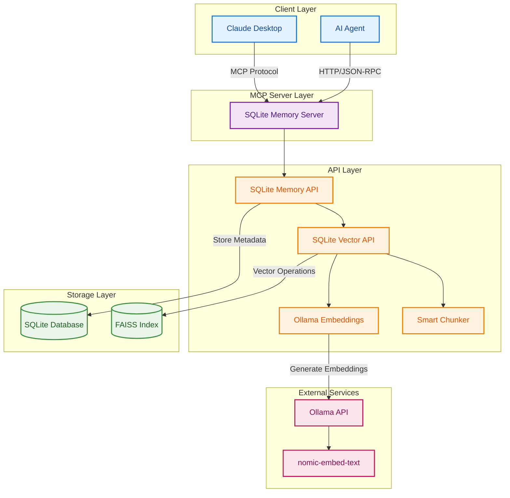
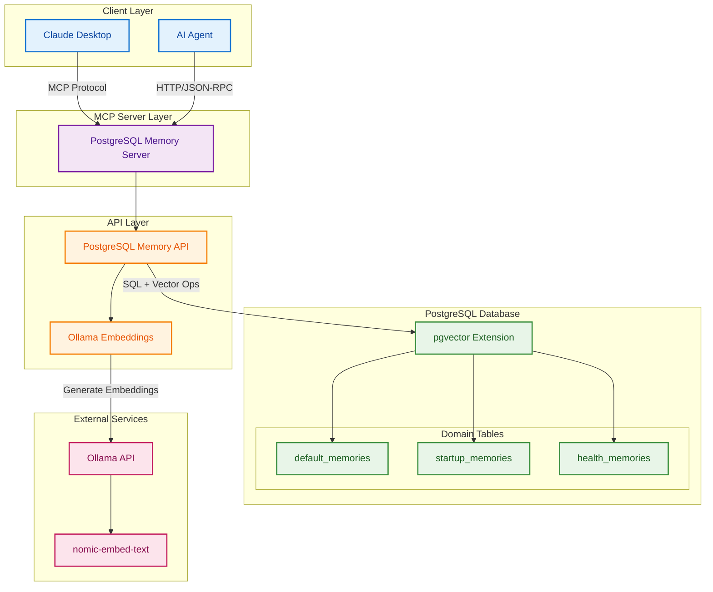

# Local Context Memory MCP

[](https://opensource.org/licenses/MIT)
[](https://www.python.org/downloads/)
[](https://modelcontextprotocol.io/)  
[](https://www.docker.com/)

Ever wanted the ChatGPT memory feature but **across all your LLMs** and stored on **your own hardware**? Ever hate how there's a **limit to how many memories** ChatGPT can store, and that you **can't segment your memories** into different domains? 

**Here's your fix.**

> **Give any AI assistant persistent, unlimited memory that you control completely.**

A production-ready persistent memory system for AI agents using the [Model Context Protocol (MCP)](https://modelcontextprotocol.io/). Works with Claude Desktop, any MCP-compatible client, and gives you the memory features you've been wanting.

## Table of Contents

- [Why This Matters](#why-this-matters)
- [Choose Your Implementation](#choose-your-implementation)
- [Tools & Capabilities](#tools--capabilities)
  - [Agency-Agents Tools](#agency-agents-tools-primary)
  - [Legacy Tools](#legacy-tools)
  - [Available Resources](#available-resources)
  - [Available Prompts](#available-prompts)
- [Agency-Agents Integration](#agency-agents-integration)
- [Architecture Diagrams](#architectures)
  - [SQLite + FAISS Implementation](#sqlite--faiss-implementation-original)
  - [PostgreSQL + pgvector Implementation](#postgresql--pgvector-implementation-new)
- [Features](#features)
- [Quick Start](#quick-start)
  - [Prerequisites](#prerequisites)
  - [Ollama Setup](#ollama-setup-optional-but-recommended)
- [Claude Desktop Setup](#claude-desktop-setup)
- [Examples](#examples)
- [Components](#components)
- [Configuration](#configuration)
- [Development](#development)
  - [Docker](#docker)
- [Manual Installation](#manual-installation)
- [Demo](#demo)
- [License](#license)

## Why This Matters

**Traditional AI Problem**: AI assistants forget everything between conversations. Every interaction starts from scratch, requiring users to repeatedly provide context about their preferences, projects, and history.

**Solution**: Local Context Memory gives your AI persistent, searchable memory that:
- 🧠 **Remembers across sessions** - User preferences, project details, conversation history
- 🎯 **Finds relevant context** - Semantic search surfaces the right memories at the right time  
- 🏢 **Organizes by domain** - Separate contexts for work, health, personal life (PostgreSQL)
- 🔒 **Stays private** - All data stored locally under your control
- ⚡ **Works immediately** - Drop-in compatibility with Claude Desktop and MCP clients

## Choose Your Implementation

- **SQLite + FAISS**: Perfect for personal use, development, and simple deployments
- **PostgreSQL + pgvector**: Production-ready with domain segmentation and team collaboration

## Tools & Capabilities



### Agency-Agents Tools (Primary)

These tools are compatible with the [Agency-Agents](https://github.com/msitarzewski/agency-agents) multi-agent workflow system.

#### `remember`
Store decisions, deliverables, and context with tags for organized recall.
- `remember(content, tags?, source?, importance?, domain?)`
- **Tags** are the primary organizational mechanism — use agent name, project name, and topic
- **Examples**:
  ```javascript
  remember("API spec: GET /products returns Product[]",
           ["backend-architect", "retroboard", "api-spec", "frontend-developer"])
  ```

#### `recall`
Search for relevant memories by tag, keyword, or semantic similarity.
- `recall(tags?, query?, domain?, limit?)`
- When **tags** are provided, filters to memories matching ALL specified tags (AND logic)
- **Examples**:
  ```javascript
  recall(["backend-architect", "retroboard"])  // find all memories from this agent+project
  recall(["frontend-developer"], "api spec")   // tags + semantic search
  ```

#### `checkpoint`
Create a named save point before risky work.
- `checkpoint(name, tags?, domain?)`
- Returns a checkpoint ID to use with `rollback`
- **Use case**: Before a series of changes that might need to be undone atomically

#### `rollback`
Atomically revert to a checkpoint, undoing all changes made after it.
- `rollback(checkpoint_id, domain?)`
- Deletes memories created after the checkpoint
- Restores memories updated after the checkpoint to their checkpoint-time state
- **Use case**: QA check fails, bad architecture decision — roll back everything at once

#### `rollback_memory`
Revert a single memory to its previous version.
- `rollback_memory(memory_id, domain?)`
- Per-memory version stack (v3 → v2 → v1)
- **Use case**: Surgical fix to one memory without affecting others

#### `list_checkpoints`
List available checkpoints for a domain.
- `list_checkpoints(domain?)`
- Returns checkpoints ordered newest first

#### `search`
Find specific memories across sessions and agents using semantic or text search.
- `search(query, domain?, limit?, use_vector?)`
- Unlike `recall`, this performs broad content-based retrieval without tag filtering
- **Examples**:
  ```javascript
  search("database schema decisions", "startup", 5)
  ```

### Legacy Tools

These are kept for backward compatibility with existing MCP clients.

#### `store_memory`
- **SQLite**: `store_memory(content, source?, importance?)`
- **PostgreSQL**: `store_memory(content, domain?, source?, importance?)`

#### `update_memory`
- **SQLite**: `update_memory(memory_id, content?, importance?)`
- **PostgreSQL**: `update_memory(memory_id, content?, importance?, domain?)`

#### `search_memories`
- **SQLite**: `search_memories(query, limit?, use_vector?)`
- **PostgreSQL**: `search_memories(query, domain?, limit?)`

#### `list_memory_domains` *(PostgreSQL Only)*
- **Returns**: `["default", "work", "health", "personal"]`

### Available Resources

#### `memory://query` *(SQLite)*
Quick semantic search via URI pattern for simple memory retrieval.

#### `memory://domain/query` *(PostgreSQL)*
Domain-scoped semantic search for isolated memory contexts.
- **Examples**:
  - `memory://work/project deadlines`
  - `memory://health/medication schedule`

### Available Prompts

#### `summarize_memories`
Generate intelligent summaries of retrieved memory collections.
- **Input**: List of memory objects
- **Output**: Structured summary highlighting key patterns and insights
- **Use case**: Create context summaries for complex topics

## Architectures

### SQLite + FAISS Implementation (Original)



### PostgreSQL + pgvector Implementation (New)


## Agency-Agents Integration

This server is compatible with the [Agency-Agents](https://github.com/msitarzewski/agency-agents) multi-agent workflow system. It provides the four tools that agency-agents expects: `remember`, `recall`, `rollback`, and `search`.

### MCP Client Configuration

Add this to your MCP client config (Claude Code, Cursor, etc.) to use with agency-agents workflows:

**Claude Code** (via CLI):
```bash
claude mcp add --transport stdio memory-server -- python3 src/postgres_memory_server.py
```

**Claude Code** (via `.mcp.json` in project root):
```json
{
  "mcpServers": {
    "memory": {
      "type": "stdio",
      "command": "python3",
      "args": ["/path/to/local-memory-mcp/src/postgres_memory_server.py"]
    }
  }
}
```

**Docker version:**
```json
{
  "mcpServers": {
    "memory": {
      "command": "docker",
      "args": ["run", "--rm", "-i",
               "-v", "/path/to/postgres-data:/var/lib/postgresql/data",
               "cunicopia/local-memory-mcp:postgres"]
    }
  }
}
```

### Workflow Pattern

Once configured, add a **Memory Integration** section to any agent prompt (see [agency-agents integration docs](https://github.com/msitarzewski/agency-agents/tree/main/integrations/mcp-memory)):

```
When you start a session:
- recall(tags=["your-agent-name", "project-name"]) to pick up previous context

When you make key decisions or complete deliverables:
- remember("what you decided and why", tags=["your-agent-name", "project-name", "topic"])

When handing off to another agent:
- remember("deliverable content", tags=["receiving-agent-name", "project-name"])

Before risky multi-step changes:
- checkpoint("before-redesign", tags=["your-agent-name", "project-name"])

When something fails:
- rollback(checkpoint_id) to atomically undo all changes since the checkpoint
- rollback_memory(memory_id) to surgically revert a single memory
```

### Multi-Agent Handoff Example

```javascript
// Backend Architect creates a checkpoint before risky redesign
chk = checkpoint("before-api-redesign", ["backend-architect", "retroboard"])

// Backend Architect stores new deliverables
remember("REST API v2: GET /api/products returns Product[]",
         ["backend-architect", "retroboard", "api-spec", "frontend-developer"])
remember("New DB schema with sharding",
         ["backend-architect", "retroboard", "db-schema"])

// Frontend Developer recalls what was left for them
recall(["frontend-developer", "retroboard"])

// QA fails — Backend Architect rolls back everything atomically
rollback(chk)
// All post-checkpoint memories deleted, all updated memories restored
```

## Features

### Common Features
- **Semantic Search**: Uses Ollama embeddings for intelligent memory retrieval
- **Smart Chunking**: Automatically breaks down long text for better search results  
- **MCP Standard**: Full MCP protocol compliance for Claude Desktop integration
- **Docker Ready**: Simple containerized deployment with self-contained images
- **Fallback Search**: Automatic fallback to text search when vector search unavailable

### SQLite + FAISS Specific
- **Local Storage**: Everything runs locally with SQLite + FAISS files
- **Zero Setup**: No database server required
- **Portable**: Single directory contains all data

### PostgreSQL + pgvector Specific  
- **Domain Segmentation**: Separate memory contexts (startup, health, personal, etc.)
- **Production Ready**: ACID compliance, concurrent access, replication support
- **Native Vector Ops**: Efficient similarity search without separate index files
- **Scalable**: Handles large datasets with proper indexing

## Quick Start

**Recommended: Use Docker for the easiest setup!** Skip all dependency management and get running in seconds.

### Option 1: Docker (Recommended)

**SQLite Version** (simplest):
```bash
# Run immediately - no setup required!
docker run --rm -i -v ./memory-data:/app/data cunicopia/local-memory-mcp:sqlite
```

**PostgreSQL Version** (with domain segmentation):
```bash
# Run immediately - includes full PostgreSQL database!
docker run --rm -i -v ./postgres-data:/var/lib/postgresql/data cunicopia/local-memory-mcp:postgres
```

That's it! The containers are self-contained and handle all dependencies automatically.


### Prerequisites
- Docker (for containerized deployment) or Python 3.12+ (for local installation)
- Ollama with `nomic-embed-text` model (optional but recommended for enhanced semantic search)

### Ollama Setup (Optional but Recommended)

Ollama enables enhanced semantic search with vector embeddings. Without it, the system falls back to text-based search.

**Installation:**
- **macOS/Windows**: Download installer from [ollama.com/download](https://ollama.com/download)
- **Linux**: `curl -fsSL https://ollama.com/install.sh | sh`

**Setup:**
```bash
# Install the embedding model
ollama pull nomic-embed-text:v1.5

# Verify it's running (should show localhost:11434)
curl http://localhost:11434/api/tags
```

## Claude Desktop Setup

Once you have the Docker containers ready (or local installation), connect to Claude Desktop by adding this to your MCP settings:

### Docker Configuration (Recommended)
```json
{
  "mcpServers": {
    "localMemoryMCP-SQLite": {
      "command": "docker",
      "args": ["run", "--rm", "-i", "-v", "/path/to/your/memory-data:/app/data", "cunicopia/local-memory-mcp:sqlite"]
    },
    
    "localMemoryMCP-PostgreSQL": {
      "command": "docker", 
      "args": ["run", "--rm", "-i", "-v", "/path/to/your/postgres-data:/var/lib/postgresql/data", "cunicopia/local-memory-mcp:postgres"]
    }
  }
}
```

**Volume Paths:** Replace `/path/to/your/memory-data` and `/path/to/your/postgres-data` with any directory where you want to store your memories (e.g., `~/Documents/memory-data`, `/Users/yourname/my-memories`, etc.)

### Local Installation Configuration (Alternative)

**Note:** Only use if you cannot use Docker. Requires manual setup first (see [Manual Installation](#manual-installation)).

```json
{
  "mcpServers": {
    "localMemoryMCP": {
      "command": "bash",
      "args": ["/path/to/local-memory-mcp/run_sqlite.sh"]
    }
  }
}
```


## Examples

### Using Agency-Agents Tools (Recommended)
```javascript
// Store a decision with tags
remember("User prefers Python for backend development",
         ["user-preferences", "tech-stack"])

// Recall by tags
recall(["user-preferences"])

// Broad semantic search
search("programming preferences")

// Store in a specific domain (PostgreSQL)
remember("Series A funding closed at $10M",
         ["startup-lead", "retroboard", "funding"],
         "startup")  // domain

// Create checkpoint, do work, roll back if needed
chk = checkpoint("before-changes")
remember("new API spec v2", ["backend-architect", "retroboard"])
rollback(chk)  // undoes everything after checkpoint
```

### Using Legacy Tools
```javascript
// SQLite
store_memory("User prefers Python for backend development", "conversation", 0.8)
search_memories("programming preferences", 5, true)

// PostgreSQL with domains
store_memory("Series A funding closed at $10M", "startup", "meeting", 0.9)
search_memories("funding", "startup", 5)
list_memory_domains()  // Returns: ["default", "startup", "health"]
```

## Components

### SQLite Implementation
- **FastMCP**: Python MCP server framework
- **SQLite**: Structured metadata and text search fallback
- **FAISS**: Vector similarity search
- **Ollama**: Local embedding generation (optional)
- **Smart Chunker**: Text processing for optimal retrieval

### PostgreSQL Implementation
- **FastMCP**: Python MCP server framework  
- **PostgreSQL**: Full database with metadata and vector storage
- **pgvector**: Native PostgreSQL vector similarity search
- **Ollama**: Local embedding generation (optional)
- **Domain Tables**: Isolated memory contexts for better organization

## Configuration

### Common Environment Variables
- `OLLAMA_API_URL`: Ollama endpoint (default: `http://localhost:11434`)
- `OLLAMA_EMBEDDING_MODEL`: Model name (default: `nomic-embed-text`)
- `MCP_SERVER_NAME`: Server name for MCP (default: `Local Context Memory`)

### SQLite Specific
- `MCP_DATA_DIR`: Data storage path (default: `./data`)

### PostgreSQL Specific
- `POSTGRES_HOST`: Database host (default: `localhost`)
- `POSTGRES_PORT`: Database port (default: `5432`)
- `POSTGRES_DB`: Database name (default: `postgres`)
- `POSTGRES_USER`: Database user (default: `postgres`)
- `POSTGRES_PASSWORD`: Database password (required)
- `DEFAULT_MEMORY_DOMAIN`: Default domain for memories (default: `default`)

## Development

### SQLite Version
```bash
pip install -r requirements.sqlite.txt
python src/sqlite_memory_server.py
```

### PostgreSQL Version
```bash
pip install -r requirements.pgvector.txt
python src/postgres_memory_server.py
```

### Docker

Docker support is fully functional with self-contained containers! Both SQLite and PostgreSQL versions run completely independently.

```bash
# Run pre-built images directly (recommended)
# SQLite version - replace './data' with your preferred data directory
docker run --rm -i -v ./data:/app/data cunicopia/local-memory-mcp:sqlite

# PostgreSQL version - replace './postgres_data' with your preferred data directory  
docker run --rm -i -v ./postgres_data:/var/lib/postgresql/data cunicopia/local-memory-mcp:postgres
```

**Building from source (optional):**
```bash
# Only needed if you want to build yourself
docker build -f Dockerfile.sqlite_version -t local-memory-mcp:sqlite_version .
docker build -f Dockerfile.postgres_version -t local-memory-mcp:postgres_version .
```

## Manual Installation

⚠️ **We strongly recommend using Docker instead** - it handles all dependencies automatically. Use this section only if Docker is not available or you have specific requirements.

### SQLite + FAISS (Simple, Local)
```bash
git clone https://github.com/cunicopia-dev/local-memory-mcp
cd local-memory-mcp
pip install -r requirements.sqlite.txt
python src/sqlite_memory_server.py
```

### PostgreSQL + pgvector (Production, Scalable)

**For Debian-based systems:**
```bash
# Install PostgreSQL + pgvector
sudo apt install postgresql postgresql-contrib
sudo apt install postgresql-17-pgvector  # Adjust version as needed

# Change directory to where you downloaded the repo
cd /path/to/local-memory-mcp

# Set up database
# PLEASE NOTE: We create a user and basic password here, please change this if you want to host it locally
psql < sql/create_user.sql
psql -U postgres < sql/setup_database.sql

# Install Python dependencies
pip install -r requirements.pgvector.txt

# Configure connection (edit .env file)
cp .env.example .env

# Run server
python src/postgres_memory_server.py
```

**For macOS:**
```bash
# Install PostgreSQL and pgvector (Homebrew-based)
brew install postgresql@17
brew services start postgresql@17

# Link psql and other tools if needed
brew link --force postgresql@17

# Install pgvector extension (PostgreSQL must be running)
# This installs the extension into your local PostgreSQL environment
brew install pgvector

# OPTIONAL: If pgvector doesn't register properly, you can manually build it
# git clone --branch v0.8.0 https://github.com/pgvector/pgvector.git
# cd pgvector
# make && make install

# PLEASE NOTE: We create a user and basic password here, please change this if you want to host it locally
psql < sql/create_user.sql

# Set up database
psql -U postgres -f sql/setup_database.sql

# Install Python dependencies
pip install -r requirements.pgvector.txt

# Configure connection (edit .env file)
cp .env.example .env

# Run server
python src/postgres_memory_server.py
```

**⚠️ SECURITY CAUTION:** Please go to sql/create_user.sql and create a more secure user and password, the ones listed are for example purposes only! Please protect your data and take your data security seriously.

## License

MIT License

## Demo

See the local memory system in action:

### Example 1


### Example 2 


